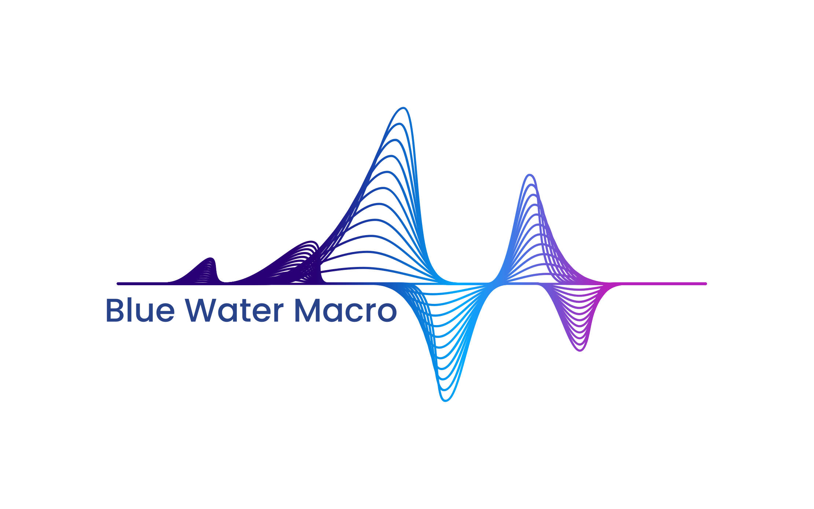

# Quantitative Trading Simulation Framework

<div align="center">



    

</div>

A hands-on educational platform for **financial engineering students** to develop, backtest, and analyze trading strategies. Built with Python, xarray, and scikit-learn, this framework guides you through the **full quantitative research cycle**: data loading, feature engineering, model exploration, simulation, benchmarking, and professional reporting.

**Developed by Conrad Gann for Blue Water Macro Corp. © 2025**

## Why This Framework?

- **Educational Focus**: Step-by-step tutorials teach core concepts like time-series cross-validation, multi-dimensional data handling with xarray, and risk-adjusted performance metrics
- **Full Research Cycle**: From raw data inputs to publication-quality PDF reports—learn how quants at hedge funds structure their workflow
- **Professional Benchmarking**: Built-in benchmark framework comparing strategies against buy-and-hold, zero-return, and custom benchmarks with information ratios and excess returns
- **xarray for Finance**: Native use of xarray for standardized, multi-dimensional reporting (e.g., results across time/assets/strategies)—a skill increasingly valued in quant roles
- **Real-World Strategies**: Simulate single-asset (e.g., SPY) and multi-asset (e.g., SPY/QQQ/IWM) predictions with position sizing, leverage, and portfolio optimization
- **Extended Data Coverage**: Now supports 15+ years of historical data (2010-present) for robust backtesting
- **Publication-Quality Output**: Professional tear sheets, performance summaries, and benchmark analysis in PDF/PNG formats
- **Capstone-Ready**: Ideal for financial engineering projects—includes exercises, extensions, and resources from QuantNet/CFA
- **Enterprise-Grade Analytics**: Leveraging Blue Water Macro's institutional insights and data science expertise

### Learning Objectives

By completing this framework, students will:

1. **Master time-series simulation** to avoid common pitfalls like look-ahead bias
2. **Use xarray for efficient data organization** and visualization in finance
3. **Build ML pipelines** for feature preprocessing and learner exploration
4. **Learn institutional benchmarking practices** - the foundation of professional quant analysis:
   - Calculate information ratios and excess returns vs standard benchmarks
   - Understand buy-and-hold vs zero-return baseline comparisons
   - Apply benchmark selection methodology used at hedge funds
   - Interpret risk-adjusted performance metrics in institutional context
5. **Generate publication-quality reports** with PDF tear sheets and performance analysis
6. **Understand portfolio construction** and risk management principles
7. **Configure advanced simulations** with flexible parameter management
8. **Apply quantitative methods** used in institutional settings

## Quick Start

```bash
# 1. Clone the repository
git clone <repo_url>
cd capstone_simulator

# 2. Create virtual environment
python3 -m venv venv
source venv/bin/activate  # On Windows: venv\Scripts\activate

# 3. Install dependencies
pip install -r requirements.txt

# 4. Launch Jupyter and start learning
jupyter notebook notebooks/01_single_target_tutorial.ipynb
```

## Repository Structure

```
quant_trading_simulator/
├── src/                    # Core production code (modular for extensions)
│   ├── utils_simulate.py   # Utilities (expanded with xarray transformers)
│   ├── single_target_simulator.py  # Basic SPY prediction simulator
│   └── multi_target_simulator.py   # Advanced multi-asset simulator
├── notebooks/              # Interactive educational tutorials
│   ├── 01_single_target_tutorial.ipynb    # Basics: Single-asset simulation
│   ├── 02_multi_target_tutorial.ipynb     # Advanced: Multi-asset strategies
│   └── 03_full_research_cycle.ipynb       # End-to-end project demo
├── docs/                   # Documentation and guides
│   ├── ERM3_2e_Data_Dictionary.md         # Blue Water Macro data schema
│   └── README.md                          # This guide
├── data/                   # Sample datasets (user-provided)
├── reports/                # Auto-generated outputs (plots, CSVs)
├── requirements.txt        # Python dependencies
└── .gitignore             # Standard project ignores
```

## Framework Components

### Core Modules (`src/`)
- **`utils_simulate.py`**: Essential utilities for data preparation, returns calculation, and xarray operations
- **`single_target_simulator.py`**: Educational single-asset (SPY) prediction framework with professional benchmarking
- **`multi_target_simulator.py`**: Production-ready multi-asset prediction and portfolio construction
- **`plotting_utils.py`**: Professional PDF tear sheets, performance visualization, and reporting utilities

### Educational Materials (`notebooks/`)
- **Tutorial 1**: Single-target simulation walkthrough with sector ETFs
- **Tutorial 2**: Multi-asset portfolio strategies with advanced position sizing
- **Tutorial 3**: Complete research cycle demonstration with exercises

### Documentation (`docs/`)
- **Data Dictionary**: Blue Water Macro's ERM3 model documentation
- **Implementation Guides**: Best practices and advanced techniques

## Example Workflow (Full Research Cycle)

```python
# 1. INPUTS: Load ETF data with extended coverage (2010-present)
import yfinance as yf
from src.single_target_simulator import load_and_prepare_data
X, y = load_and_prepare_data(['SPY', 'XLK', 'XLF'], 'SPY', start_date='2010-01-01')

# 2. CONFIGURATION: Professional simulation setup
config = {
    "target_etf": "SPY",
    "feature_etfs": ['XLK', 'XLF', 'XLV', 'XLY', 'XLP', 'XLE', 'XLI', 'XLB', 'XLU'],
    "start_date": "2010-01-01",
    "window_size": 400,
    "window_type": "expanding",
    "author": "Your Name"
}

# 3. BENCHMARKING: Setup professional benchmark comparison
from src.single_target_simulator import SingleTargetBenchmarkManager, SingleTargetBenchmarkConfig
benchmark_config = SingleTargetBenchmarkConfig()
benchmark_manager = SingleTargetBenchmarkManager(
    target_etf=config["target_etf"],
    feature_etfs=config["feature_etfs"],
    config=benchmark_config
)

# 4. SIMULATION: Walk-forward backtesting with multiple strategies
from src.single_target_simulator import Simulate, L_func_2, L_func_3, L_func_4
from sklearn.ensemble import RandomForestRegressor
from sklearn.pipeline import Pipeline
from src.utils_simulate import EWMTransformer

# Define position sizing strategies
position_strategies = [
    ('Binary', L_func_2),
    ('Quartile', L_func_3), 
    ('Proportional', L_func_4)
]

# Run simulation sweep
regout_list = []
sweep_tags = []

for pos_name, pos_func in position_strategies:
    pipe = Pipeline([
        ('ewm', EWMTransformer(halflife=4)), 
        ('rf', RandomForestRegressor(n_estimators=50))
    ])
    
    regout = Simulate(X, y, window_size=400, pipe_steps=pipe, L_func=pos_func)
    regout_list.append(regout)
    sweep_tags.append(f'rf_ewm4_{pos_name.lower()}')

# 5. PROFESSIONAL ANALYSIS: Statistics with benchmarking
from src.single_target_simulator import sim_stats_single_target
stats_df, enhanced_results = sim_stats_single_target(
    regout_list, sweep_tags,
    target_etf=config["target_etf"],
    feature_etfs=config["feature_etfs"], 
    benchmark_manager=benchmark_manager,
    config=config
)

# 6. REPORTING: Generate publication-quality PDF tear sheets
from src.plotting_utils import create_professional_tear_sheet
pdf_path = create_professional_tear_sheet(
    list(enhanced_results.values()), sweep_tags, config
)

print(f"📊 Professional analysis complete!")
print(f"📄 PDF Report: {pdf_path}")
print(f"📈 Best Strategy: {stats_df.loc['sharpe'].idxmax()}")
print(f"🎯 Best Benchmark: {stats_df.loc['best_benchmark', sweep_tags[0]]}")
print(f"💰 Excess Return: {stats_df.loc['best_excess_return', sweep_tags[0]]:.2%}")
```

**Key Features Demonstrated:**
- ✅ **Extended Data Coverage**: 15+ years (2010-present) 
- ✅ **Professional Benchmarking**: Information ratios vs buy-and-hold/zero-return
- ✅ **Multiple Position Strategies**: Binary, quartile, proportional sizing
- ✅ **PDF Tear Sheets**: Publication-quality performance reports
- ✅ **Comprehensive Metrics**: Sharpe ratios, drawdowns, leverage analysis
```

See `notebooks/03_full_research_cycle.ipynb` for a complete implementation.

## Professional Benchmarking Framework

The framework includes a sophisticated benchmarking system that compares your strategies against standard financial benchmarks:

### Benchmark Types
- **Buy-and-Hold**: Pure buy-and-hold of target ETF (e.g., SPY)
- **Zero Return**: Cash equivalent (risk-free baseline)
- **Custom Benchmarks**: Market indices, sector ETFs, risk parity strategies

### Benchmark Metrics
- **Information Ratio**: Risk-adjusted excess return vs benchmark
- **Excess Return**: Annualized outperformance (strategy return - benchmark return)
- **Tracking Error**: Volatility of excess returns
- **Best Benchmark Selection**: Automatically identifies optimal comparison benchmark

### Configuration Example
```python
from src.single_target_simulator import SingleTargetBenchmarkConfig, SingleTargetBenchmarkManager

# Configure benchmarking parameters
benchmark_config = SingleTargetBenchmarkConfig(
    include_transaction_costs=True,
    rebalancing_frequency='daily'  # 'daily', 'weekly', 'monthly'
)

# Initialize benchmark manager
benchmark_manager = SingleTargetBenchmarkManager(
    target_etf='SPY',
    feature_etfs=['XLK', 'XLF', 'XLV'],
    config=benchmark_config
)
```

### PDF Tear Sheet Output
The framework generates professional tear sheets including:
- **Strategy Performance Table**: Returns, Sharpe ratios, max drawdown
- **Best Benchmark Analysis**: Optimal benchmark for each strategy
- **Excess Return Metrics**: Outperformance vs benchmarks
- **Information Ratios**: Risk-adjusted performance comparison

## Student Exercises & Capstone Ideas

### Beginner Exercises (Focus on Benchmarking Fundamentals)
1. **Benchmark Selection Analysis**: Compare your SPY strategy against different benchmarks:
   - Buy-and-hold SPY vs zero-return baseline - which tells you more about strategy skill?
   - Calculate and interpret information ratios - what does a 0.8 vs 1.2 Info Ratio mean?
   - Analyze when benchmarks disagree - why might buy-and-hold show negative excess return while zero-return shows positive?
2. **Risk-Adjusted Performance Deep Dive**: 
   - Compare raw returns vs Sharpe ratios vs information ratios - when do they give different rankings?
   - Study periods where your strategy underperforms benchmarks - what market conditions cause this?
3. **Position Sizing vs Benchmarking**: Implement volatility-adjusted position sizing and see how it affects benchmark comparisons
4. **Model Comparison Through Benchmarking Lens**: Compare Ridge, Random Forest, and Linear models - do better prediction models always have better benchmark performance?

### Intermediate Projects (Advanced Benchmarking Applications)
1. **Benchmark Regime Analysis**: How do your strategies perform vs benchmarks in different market regimes?
   - Bull markets (2010-2018): Does your strategy add value when markets are rising?
   - Bear markets (2008 crisis, COVID-19): Does benchmarking reveal defensive characteristics?
   - Sideways markets: When do active strategies most outperform buy-and-hold?
2. **Multi-Timeframe Benchmark Consistency**: 
   - Compare daily vs weekly vs monthly rebalancing - do information ratios stay consistent?
   - Study transaction cost impact on benchmark comparisons
3. **Rolling Benchmark Analysis**: Use 1-year rolling windows to study:
   - When does your strategy consistently beat benchmarks vs when it struggles?
   - How stable are information ratios over time?
4. **Custom Benchmark Construction**: Build sector-rotation benchmarks and compare performance attribution

### Advanced Capstone Projects
1. **Regime Detection**: Implement bull/bear market switching using hidden Markov models with benchmark-aware transitions
2. **Transaction Cost Integration**: Add realistic trading costs to benchmark comparisons
3. **Multi-Asset Benchmarking**: Extend single-target benchmarking to portfolio-level analysis  
4. **Alternative Data Integration**: Incorporate sentiment analysis or economic indicators with benchmark validation
5. **Publication-Quality Research**: Generate academic-style performance attribution analysis
5. **Portfolio Optimization**: Apply Modern Portfolio Theory for asset allocation

## Strategy Pipeline Overview

Comprehensive overview of all implemented strategies with preprocessing, learning algorithms, portfolio construction, and complexity scores:

| Strategy | Preprocessing | Learner | Portfolio Construction | Key Parameters | Complexity Score |
|----------|---------------|---------|----------------------|----------------|------------------|
| **mt_linear_std_EqualWeight** | StandardScaler | LinearRegression | Equal allocation across predictions | `base_leverage=1.0` | ⭐ (1/5) |
| **mt_linear_std_ConfidenceWeighted** | StandardScaler | LinearRegression | Prediction magnitude weighting | `max_leverage=2.0` | ⭐⭐ (2/5) |
| **mt_linear_std_LongShort** | StandardScaler | LinearRegression | Long top tercile, short bottom tercile | `base_leverage=1.0` | ⭐⭐⭐ (3/5) |
| **mt_huber_std_EqualWeight** | StandardScaler | HuberRegressor (ε=1.35) | Equal allocation across predictions | `base_leverage=1.0` | ⭐⭐ (2/5) |
| **mt_huber_std_ConfidenceWeighted** | StandardScaler | HuberRegressor (ε=1.35) | Prediction magnitude weighting | `max_leverage=2.0` | ⭐⭐⭐ (3/5) |
| **mt_huber_std_LongShort** | StandardScaler | HuberRegressor (ε=1.35) | Long top tercile, short bottom tercile | `base_leverage=1.0` | ⭐⭐⭐⭐ (4/5) |
| **mt_elasticnet_std_EqualWeight** | StandardScaler | ElasticNet (α=0.01, l1_ratio=0.5) | Equal allocation across predictions | `base_leverage=1.0` | ⭐⭐ (2/5) |
| **mt_elasticnet_std_ConfidenceWeighted** | StandardScaler | ElasticNet (α=0.01, l1_ratio=0.5) | Prediction magnitude weighting | `max_leverage=2.0` | ⭐⭐⭐ (3/5) |
| **mt_elasticnet_std_LongShort** | StandardScaler | ElasticNet (α=0.01, l1_ratio=0.5) | Long top tercile, short bottom tercile | `base_leverage=1.0` | ⭐⭐⭐⭐ (4/5) |
| **st_rf_ewm_Binary** | EWMTransformer (halflife=4) | RandomForestRegressor | Binary long/short based on prediction sign | `n_estimators=50` | ⭐⭐⭐ (3/5) |
| **st_rf_ewm_Quartile** | EWMTransformer (halflife=4) | RandomForestRegressor | Quartile-based position sizing (0%, 33%, 67%, 100%) | `n_estimators=50` | ⭐⭐⭐⭐ (4/5) |
| **st_rf_ewm_Proportional** | EWMTransformer (halflife=4) | RandomForestRegressor | Position size proportional to prediction | `n_estimators=50` | ⭐⭐⭐⭐⭐ (5/5) |

### Complexity Score Legend
- ⭐ **Simple**: Basic pipeline, minimal parameters, easy to interpret
- ⭐⭐ **Moderate**: Standard ML preprocessing, some portfolio logic
- ⭐⭐⭐ **Intermediate**: Multiple decision points, ranking-based allocation
- ⭐⭐⭐⭐ **Advanced**: Sophisticated ML + complex portfolio construction
- ⭐⭐⭐⭐⭐ **Expert**: High-dimensional optimization, continuous position scaling

### Pipeline Architecture Notes
- **mt_**: Multi-target strategies using `MultiOutputRegressor` for simultaneous ETF prediction
- **st_**: Single-target strategies focused on individual asset (e.g., SPY) prediction
- **StandardScaler**: Z-score normalization for feature standardization
- **EWMTransformer**: Exponentially weighted moving averages for time-series smoothing
- **Portfolio Construction**: Three main approaches - equal allocation, confidence weighting, and long-short market-neutral

## Performance Expectations

Based on historical backtests using Blue Water Macro's methodology (2015-2024):

| Strategy Type | Typical Sharpe | Max Drawdown | Best Use Case |
|---------------|----------------|--------------|---------------|
| **Equal Weight** | 0.8 - 1.2 | 15-25% | Conservative, diversified |
| **Confidence Weighted** | 1.0 - 1.8 | 20-35% | Moderate risk, adaptive |
| **Long-Short** | 1.2 - 2.5 | 10-20% | Market-neutral strategies |

## Educational Resources

### Academic References
- **QuantNet Forums**: [quantnet.com](https://quantnet.com) - Premier quantitative finance community
- **CFA Institute**: [cfainstitute.org](https://cfainstitute.org) - Professional certification and readings
- **xarray Documentation**: [xarray.pydata.org](https://xarray.pydata.org/en/stable/examples/finance.html) - Financial data handling

### Professional Development
- **Blue Water Macro**: Enterprise-grade data and analytics for institutional research
- **Industry Applications**: Portfolio management, risk analytics, algorithmic trading
- **Career Paths**: Quantitative researcher, portfolio manager, risk analyst

## Getting Help

### Technical Support
- **GitHub Issues**: Report bugs and request features
- **Documentation**: Comprehensive guides in `docs/` folder
- **Code Comments**: Detailed inline explanations throughout codebase

### Academic Guidance
- **Office Hours**: Contact [Capstone@BlueWaterMacro.com] for capstone project guidance
- **Collaboration**: Connect with other students on QuantNet forums
- **Industry Mentorship**: Blue Water Macro internship and career opportunities

## Disclaimer

This educational framework is provided for learning purposes. Past performance does not guarantee future results. Always conduct thorough due diligence before making investment decisions. Blue Water Macro Corp. provides no warranty regarding the accuracy or completeness of this software.

## License

This project is licensed under the **Blue Water Macro Educational License (BWMEL)** - see the [LICENSE](../LICENSE) file for complete terms.

### 📚 **Educational Use**
- ✅ **Free for students and educators** at accredited institutions
- ✅ **Research and academic publication** permitted with attribution
- ✅ **Capstone projects and dissertations** encouraged
- ✅ **Modifications for educational purposes** allowed

### 🏢 **Commercial Use**
- 📧 **Commercial licensing available** - contact licensing@bluewatermacro.com
- 🤝 **Enterprise partnerships welcome** for institutional adoption
- 💼 **Career opportunities** for exceptional student contributors

### ⚖️ **Key Requirements**
- **Attribution**: Must credit "Blue Water Macro Quantitative Trading Framework"
- **Educational Focus**: Commercial use requires separate license
- **Share-Alike**: Educational improvements should benefit the community
- **Financial Disclaimer**: For educational purposes only - not investment advice

---

**Build your quantitative finance career with enterprise-grade tools and institutional insights.**

*Leveraging Blue Water Macro's ERM3 model for comprehensive market analysis and strategy development.*